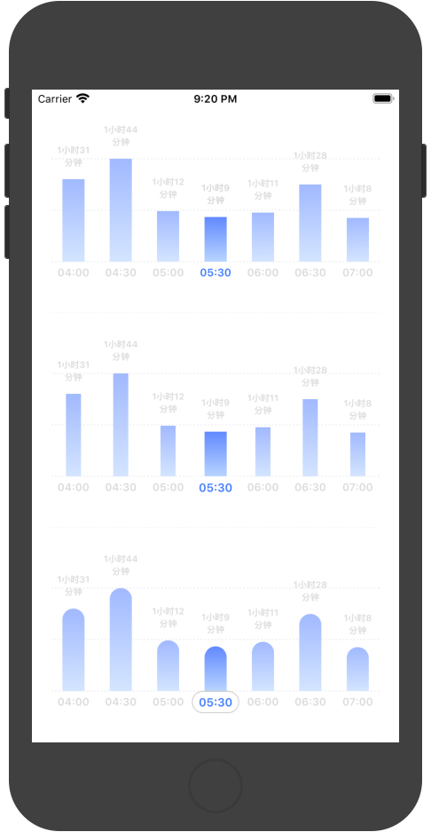

# ChartView
Flexible char view

## Features
Chart view use for displaying data that related to date in a day.It is scolling smoothly, and animated.

    1. used Core Animation.
    2. the scroll gesture adopt from UIScrollView.
    3. customed sliding inertial animation.

## SnapShot

There are three types of charts to select:



## How to use

Ex:
```

@implementation ViewController
{
    ChartView *_chartView_mask;
    ChartView *_chartView_animate;
    ChartView *_chartView_zoom;
}

- (void)viewDidLoad {
    [super viewDidLoad];
    
    _chartView_mask = [[ChartView alloc] initWithDate:[NSDate dateWithTimeIntervalSince1970:1599125400000] type:ChartViewType_mask];
    [self.view addSubview:_chartView_mask];
    
    _chartView_animate = [[ChartView alloc] initWithDate:[NSDate dateWithTimeIntervalSince1970:1599125400000] type:ChartViewType_animate];
    [self.view addSubview:_chartView_animate];
    
    _chartView_zoom = [[ChartView alloc] initWithDate:[NSDate dateWithTimeIntervalSince1970:1599125400000] type:ChartViewType_zoom];
    [self.view addSubview:_chartView_zoom];
    
    CGFloat screenWidth = CGRectGetWidth(self.view.frame);
    CGFloat screenHeight = CGRectGetHeight(self.view.frame);
    CGFloat space_h = 20.0, space_v = 10.0, height = (screenHeight - 4.0 * space_v)/3.0, baseY = 20.0;
    _chartView_mask.frame = CGRectMake(space_h, baseY, screenWidth - space_h * 2, height); baseY += space_v + height;
    _chartView_animate.frame = CGRectMake(space_h, baseY, screenWidth - space_h * 2, height); baseY += space_v + height;
    _chartView_zoom.frame = CGRectMake(space_h, baseY , screenWidth - space_h * 2, height);
    
    dispatch_after(dispatch_time(DISPATCH_TIME_NOW, (int64_t)(0.3 * NSEC_PER_SEC)), dispatch_get_main_queue(), ^{
        int32_t etas[] = {5460, 6206, 4304, 4085, 4251, 5265, 4057, 3864};
        int64_t timestamp = 1599125400000;
        int count = sizeof(etas)/sizeof(int32_t);
                
        [self->_chartView_mask reloadData:etas beginTimestamp:timestamp count:count];
        [self->_chartView_mask recalculateBarItemLayersHeight];
        [self->_chartView_mask scrollToDate:[NSDate dateWithTimeIntervalSince1970:timestamp]];
        
        [self->_chartView_animate reloadData:etas beginTimestamp:timestamp count:count];
        [self->_chartView_animate recalculateBarItemLayersHeight];
        [self->_chartView_animate scrollToDate:[NSDate dateWithTimeIntervalSince1970:timestamp]];
        
        [self->_chartView_zoom reloadData:etas beginTimestamp:timestamp count:count];
        [self->_chartView_zoom recalculateBarItemLayersHeight];
        [self->_chartView_zoom scrollToDate:[NSDate dateWithTimeIntervalSince1970:timestamp]];
    });
}

@end

```